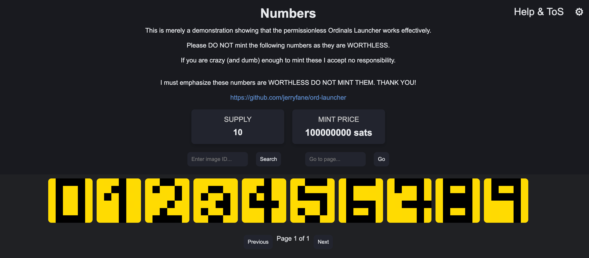

# Ordinals Launcher

## Introduction

The Ordinals Launcher is the first permissionless launcher for ordinals collections, leveraging inscriptions to allow collection creators and minters to mint ordinals with ease.

You can monitor collections launched using the Ordinals Launcher using this [Dashboard](https://dune.com/j543/ordinals-launcher)

*Example of the Ordinals Launcher at: [inscription_id](https://ordinals.com/content/<inscription_id>)*

## Current Recursive Inscription IDs:

| File Path                | INSCRIPTION ID                                               |
| ------------------------ | ------------------------------------------------------------ |
| `/src/content/script.js` | `679651a8581bb7869a895dfaea4f61fe706a5f42ff1746f0da4f7011dfc43ebbi0` |
| `/src/content/style.css` | `e69e980a39eae520c0cf41a4eb1b18bc318ed0ebd56eb87f316823f598cac70ci0` |
| `/src/content/tos.html`  | `b400fa11332a95b434e7be5a008849220d85ee2ad8985d010a18a77dff2a2203i0` |

## How It Works

The Ordinals Launcher is a recursive inscription. Collection creators can compile the `/src/asset.html` file with their collection details and inscribe it for a fully functional launcher on-chain. Minters can then open this inscription from any ordinals explorer (e.g., [Ordinals.com](https://ordinals.com)) and mint the assets using the Xverse wallet ([xverse.app](https://xverse.app)).

### Requirements

- **IPFS Integration:** For proper display of non-inscribed assets on Ordinals Explorer, the launcher utilizes IPFS.
- **Inscription Helper Extension:** The optimal functionality of the Ordinals Launcher requires the Inscription Helper browser extension. [Inscription Helper](https://github.com/jerryfane/inscription-helper). 

## Terms of Service

Please read the ToS at `/src/tos.html` before using, launching, or minting any collection or asset on the Ordinals Launcher.

## Donations

Contributions are welcomed to support updates and development. If you wish to donate, please send BTC to: `bc1pk5wln2zvku0gj6mh9lfzvvn8ucnmk5r4lyl78q5g7zsf7cu07avql6rr7q`.

## Launching Your Collection

To launch your collection using the Ordinals Launcher, follow these steps:

1. **Upload Assets:** Upload your assets (currently supporting images) to IPFS under the same folder. Name your assets as `1.png`, `2.png`, ..., `<YOURSUPPLY>.png`, starting from 1. You can use tools like [Thirdweb Storage](https://thirdweb.com/dashboard/infrastructure/storage) for IPFS uploads.

2. **Copy IPFS Reference:** Copy the IPFS reference/pointer to your folder.

3. **Prepare `asset.html`:** Copy `/src/asset.html` and insert your collection details. Ensure accuracy, especially the recursive inscription reference, IPFS reference to your digital assets, and if applicable, your receiving address for paid mints.

   | Parameter | Description                                  |
   | --------- | -------------------------------------------- |
   | n         | Name of your collection                      |
   | d         | Description of your collection               |
   | s         | Supply                                       |
   | ipfs      | IPFS pointer to your folder                  |
   | format    | Format of your assets (e.g., png, jpg, webp) |
   | a         | (Optional) Receiver address for paid mints   |
   | f         | (Optional) Fee in sats for paid mints        |

4. **Inscribe `asset.html`:** Inscribe the `asset.html` file using any inscription service.

5. **Share Inscription ID:** Distribute the inscription ID of the file to your minters.

## License

The Ordinals Launcher is open source, provided under the [MIT license](https://opensource.org/license/mit/).